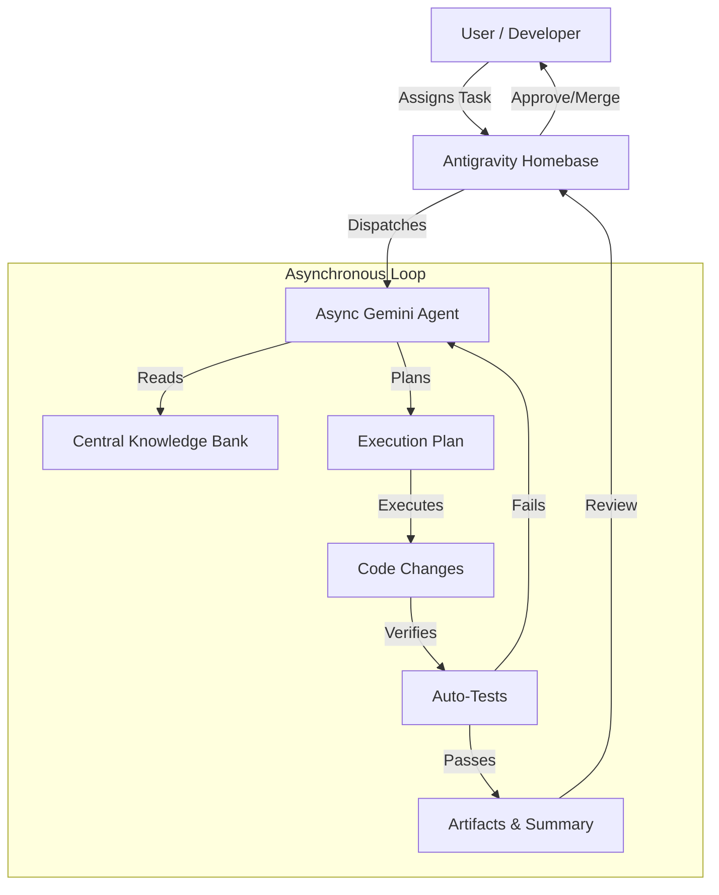

For the last two years, the AI industry has been obsessed with "reasoning"—how well a model can think through a problem. Today, with the simultaneous launch of **Gemini 3 Pro** and the **Google Antigravity** platform, Google is signaling that thinking is no longer enough.

We are shifting from the "Era of Thinking" to the **"Era of Action."**

The headline isn't just about bigger numbers or better benchmarks; it’s about a model architecture designed to think, plan, and execute asynchronous tasks, and a platform designed to let them.

In this post, we'll dive into the architecture of Gemini 3 Pro, walk through a code tutorial on how to use the new `thinking_config`, and explore how Google Antigravity might change how we build software.

---

## 1. Under the Hood: Gemini 3 Pro


According to the newly released Model Card, **Gemini 3 Pro (`gemini-3-pro-preview`)** is a **Sparse Mixture-of-Experts (MoE)** transformer model.

### Efficiency at Scale
By utilizing a sparse MoE architecture, Google has managed to create a massive model that activates only a subset of "experts" per token. The result is a model that is "natively multimodal" (Text, Audio, Video, Image) with a massive **1M context window**, yet maintains low latency and serving costs comparable to much smaller models.

### The Benchmarks That Matter
Gemini 3 Pro isn't just trading blows with its competitors; in specific domains relevant to agents, it is setting new standards.

*   **Reasoning (MathArena Apex):** Gemini 3 Pro scored **23.4%**. For context, previous SOTA models often scored significantly lower (some below 2%). This represents a generational leap in solving novel, complex problems.
*   **Computer Control (ScreenSpot-Pro):** This is the critical metric for agents that need to use software. Gemini 3 Pro scored **72.7%** on screen understanding, roughly double the performance of leading competitors like Claude (36.2%).

    > *Note: While the model excels at these benchmarks, the "Computer Use" tool is currently not enabled in the public API.*


### Pricing for Agents
Google is aggressively pricing this model to encourage "agentic loops"—workflows where an AI might call itself multiple times to solve a problem.

| Context Window | Input Cost (per 1M tokens) | Output Cost (per 1M tokens) |
| :--- | :--- | :--- |
| **Standard (< 200k)** | $2.00 | $12.00 |
| **Long Context (> 200k)** | $4.00 | $18.00 |

*Note: There is currently no free tier for `gemini-3-pro-preview` in the API.*

---

## 2. Developer Tutorial: Coding with "Thinking Models"

The most significant API change in this release is the introduction of **Thinking Models** with adjustable configurations. Unlike previous "chain-of-thought" prompting where you had to beg the model to "think step by step," Gemini 3 Pro allows you to programmatically enforce reasoning depth.

### New API Features
Beyond thinking, Gemini 3 Pro introduces granular control over multimodal processing:
*   **`thinking_level`:** Controls reasoning depth (`low` for speed, `high` for complex tasks).
*   **`media_resolution`:** Manages token usage for images, videos and PDFs (`low`, `medium`, `high`). For example, you can lower resolution to save costs on video analysis or raise it for text-heavy PDFs.
*   **Structured Outputs + Tools:** You can now combine JSON schemas with tools like Google Search, allowing for structured data extraction from live web results.
*   **Thought Signatures:** A behind-the-scenes feature handled by the SDK to maintain reasoning context across API calls.

### Prerequisites
Ensure you have the updated SDK:
```bash
pip install -U google-genai python-dotenv
```

### The Implementation
In this example, we'll set the model to "High Thinking" mode. 

**Migration Tips:**
*   **Temperature:** Unlike Gemini 2.5, do **not** lower the temperature for reasoning tasks. Google recommends leaving `temperature` at the default (1.0) for Gemini 3 to avoid performance degradation.
*   **PDF & Docs:** The default OCR resolution has changed. If you need to parse dense documents, test the new `MEDIA_RESOLUTION_HIGH` setting.
*   **Prompting:** Simplification is key. If you used complex "chain-of-thought" prompts for Gemini 2.5, try removing them and letting the `thinking_level="high"` do the heavy lifting.

```python
import os
from google import genai
from dotenv import load_dotenv

# Load environment variables
load_dotenv()

# 1. Configure the API Key
api_key = os.getenv("GEMINI_API_KEY")
if not api_key:
    print("Error: GEMINI_API_KEY not found in environment variables.")
    return

# 2. Initialize the Client
client = genai.Client(api_key=api_key)
model_name = "gemini-3-pro-preview"

# 5. Define a Complex Prompt (Refactoring Task)
prompt = """
I have a legacy Python snippet that processes files synchronously. 
Please refactor this to use `asyncio` for better performance.

Legacy Code:
import time
def process_file(filename):
    time.sleep(1) # Simulate work
    return f"Processed {filename}"
    
def main(files):
    results = []
    for f in files:
        results.append(process_file(f))
    return results

Also, explain potential race conditions if these files were shared resources.
"""

print(f"Sending prompt to {model_name} with Thinking Level: HIGH...\n")

try:
    # 6. Generate Content
    response = client.models.generate_content(
        model=model_name,
        contents=prompt,
        config=types.GenerateContentConfig(
            thinking_config=types.ThinkingConfig(
            thinking_level="HIGH",
            include_thoughts=True
            )
        )
    )

    # 7. Display the "Thinking" Process (if available)
    for part in response.parts:
        if hasattr(part, 'thought') and part.thought:
            print("--- 🧠 Model Thoughts (Reasoning Trace) ---")
            print(part.text) # In Gemini 3, thoughts are in the text part when thought=True
            print("-------------------------------------------\n")
        else:
                # 8. Display the Final Output
            print("--- 📝 Final Solution ---")
            print(part.text)

except Exception as e:
    print(f"An error occurred during generation: {e}")
```


**Note:** The `thinking_level` abstracts the token budget. You don't need to calculate how many tokens the model needs to think; you just tell it to think "High" or "Low."

---

### 3. Controlling Vision Costs with Media Resolution

Gemini 3 Pro introduces a powerful new feature for developers working with multimodal inputs: **Media Resolution**.

Previously, you had little control over how many tokens an image or PDF page consumed. Now, you can explicitly trade off fidelity for cost (or vice versa).

*   **High (Default for Images):** 1120 tokens. Best for OCR and detailed inspection.
*   **Medium:** 560 tokens. Good balance for general captioning.
*   **Low:** 280 tokens. Ideal for high-volume classification or video frames.

Here is how to implement it using the `v1alpha` client:

```python
import os
import base64
from google import genai
from google.genai import types

    api_key = os.getenv("GEMINI_API_KEY")
    if not api_key:
        print("Error: GEMINI_API_KEY not found.")
        return

    # Note: Media resolution currently requires the v1alpha API version
    client = genai.Client(
        api_key=api_key,
        http_options={'api_version': 'v1alpha'}
    )
    
    print("Configuring Media Resolution...")
    print("- MEDIA_RESOLUTION_LOW: 280 tokens (Images), 70 tokens (Video frames)")
    print("- MEDIA_RESOLUTION_MEDIUM: 560 tokens (Images), 70 tokens (Video frames)")
    print("- MEDIA_RESOLUTION_HIGH: 1120 tokens (Images), 280 tokens (Video frames)")

    # Load the image
    with open("image.png", "rb") as image_file:
        image_data = image_file.read()
        base64_image = base64.b64encode(image_data).decode("utf-8")

    # Example construction of the request
    response = client.models.generate_content(
        model="gemini-3-pro-preview",
        contents=[
            types.Content(
                parts=[
                    types.Part(text="What is in this image?"),
                    types.Part(
                        inline_data=types.Blob(
                            mime_type="image/jpeg",
                            data=base64_image,
                        ),
                        media_resolution={"level": "media_resolution_high"}
                    )
                ]
            )
        ]
    )
    print(response.text)
```

---

## 4. Thought Signatures: Maintaining the Chain of Reason

One of the subtle but critical additions in Gemini 3 Pro is the **Thought Signature**.

When a model "thinks" (especially in a multi-turn agentic loop), it builds up internal state—a "chain of reason." In previous stateless APIs, this reasoning was often lost between turns, forcing the model to re-derive context from the raw chat history.

**Thought Signatures** are encrypted representations of the model's internal thought process. To ensure the model maintains its reasoning capabilities (and IQ) across a conversation, you must return these signatures back to the model in your subsequent requests.

> **Good News for SDK Users:** If you use the official Google Gen AI SDKs (Python, Node, Java) and maintain standard chat history, **Thought Signatures are handled automatically**. You don't need to manually manage them.

However, understanding them is crucial for debugging or building custom REST implementations.

### How It Works (The "Under the Hood" View)

For **Function Calling**, the validation is strict. If the model calls a tool, it generates a signature. When you return the tool's output, you *must* include that signature, or the model will lose its train of thought (and the API will return a 400 error).

Here is what a multi-step turn looks like in JSON:

**Step 1: Model decides to check Server Status**
The response includes a `thoughtSignature` alongside the function call.

```json
{
  "role": "model",
  "parts": [
    {
      "functionCall": { "name": "check_server_status", "args": {"host": "db-prod-01"} },
      "thoughtSignature": "<Sig_A>" // <-- SAVE THIS
    }
  ]
}
```

**Step 2: User returns Status Result**
You send the tool output *and* the signature back.

```json
[
  { "role": "user", "parts": [{ "text": "Check status of db-prod-01..." }] },
  { 
    "role": "model", 
    "parts": [
      { 
        "functionCall": { "name": "check_server_status", "args": {"host": "db-prod-01"} }, 
        "thoughtSignature": "<Sig_A>" // <-- REQUIRED RETURN
      } 
    ]
  },
  { "role": "user", "parts": [{ "functionResponse": { "name": "check_server_status", "response": {"status": "critical", "load": 99} } }] }
]
```

If the model then decides to call *another* tool (e.g., "Restart Service") based on that status data, it will generate `<Sig_B>`, and your history must eventually contain both. This chain ensures that Gemini 3's "High Thinking" state is preserved throughout the entire task execution.

---

## 5. Google Antigravity: The Agent-First IDE


While Gemini 3 Pro is the engine, **Google Antigravity** is the cockpit.

Described as a "New Agentic Development Platform," Antigravity attempts to solve the biggest UX problem in AI coding: **Latency and Context.**

In a traditional IDE (like VS Code with Copilot), the workflow is synchronous: you ask, you wait, you paste. Antigravity introduces a bifurcation of labor:

1.  **Synchronous Agents:** Embedded in the code editor for immediate, small-scale help.
2.  **Asynchronous Agents:** You assign a task (e.g., "Migrate this module to TypeScript"), and the agent works in the background.

### The "Homebase" Concept
Instead of a chat window that disappears when you close it, Antigravity introduces a **"Homebase"**—a dashboard of active tasks.



This "Trust and Verify" loop is designed to let humans manage AI as a workforce, rather than just chatting with a bot. The **Central Knowledge Bank** solves the "amnesia" problem, allowing the agent to improve continuously based on stored context about your specific project.

---

## 6. Safety and The Frontier

With agents capable of executing code and controlling browsers, safety is paramount. [The Gemini 3 Pro Model Card](https://storage.googleapis.com/deepmind-media/Model-Cards/Gemini-3-Pro-Model-Card.pdf) includes an extensive **Frontier Safety Framework (FSF)** evaluation.

The model was subjected to extensive **Human Red Teaming** to ensure that its ability to act doesn't outpace its safety guardrails. While it shows significant improvements in reasoning, it still adheres to strict safety policies regarding CBRN (Chemical, Biological, Radiological, Nuclear) threats and autonomous cyber-offense.

---

## Conclusion

Gemini 3 Pro is a statement. By optimizing for "Sparse MoE" efficiency and "Computer Use" benchmarks, Google isn't just building a better chatbot; they are building a virtual employee.

With pricing set at $2/1M input, the barrier to entry for building complex, multi-step agentic workflows has never been lower. The tools are here—now it's time to build.

### Resources
*   [Gemini 3 Pro Announcement Blog](https://blog.google/products/gemini/gemini-3/)
*   [Google Antigravity Platform](https://antigravity.google/blog/introducing-google-antigravity)
*   [Gemini 3 API Documentation](https://ai.google.dev/gemini-api/docs/gemini-3)
*   [Gemini 3 Pro Model Card](https://storage.googleapis.com/deepmind-media/Model-Cards/Gemini-3-Pro-Model-Card.pdf)
