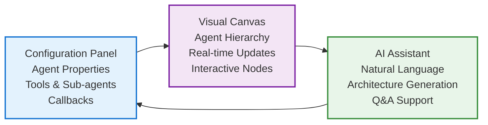
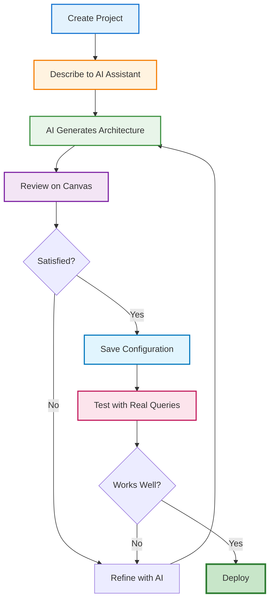
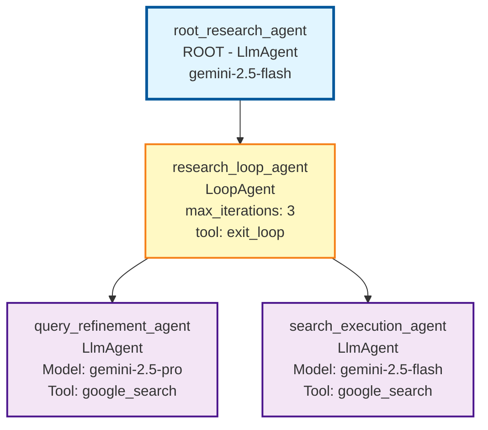

If you've ever built multi-agent systems, you know the pain: juggling YAML files, mentally tracking agent hierarchies, debugging configuration errors, and constantly referencing documentation to get the syntax right. Google's Agent Development Kit (ADK) just changed that game.

Google ADK v1.18.0 introduced the **Visual Agent Builder** - a browser-based interface that lets you design, configure, and test complex multi-agent systems through drag-and-drop interactions and natural language conversations. No more hand-crafting YAML. No more syntax errors. Just pure agent architecture.

I've spent the last few days exploring this feature, and I'm genuinely excited about what it enables. Let me show you how to build a research agent system from scratch using the Visual Builder.

## What is Google ADK Visual Agent Builder?

The Visual Agent Builder is a web-based IDE for creating ADK agents. Think of it as a combination of a visual workflow designer, configuration editor, and AI assistant all working together. Here's what makes it powerful:

- **Visual Workflow Designer**: See your agent hierarchy as a graph. Root agents, sub-agents, tools - everything mapped out visually on a canvas.

- **Configuration Panel**: Edit agent properties (name, model, instructions, tools) through forms instead of raw YAML.

- **AI Assistant**: Describe what you want in plain English, and the assistant generates the agent architecture for you.

- **Built-in Tool Integration**: Browse and add tools like Google Search, code executors, and memory management through a searchable dialog.

- **Live Testing**: Test your agents immediately in the same interface where you build them. No context switching.

- **Callback Management**: Configure all six callback types (before/after agent, model, tool) through the UI.

The beauty is that everything you do in the Visual Builder generates proper ADK YAML configurations under the hood. You can export them, version control them, and deploy them just like code-based agents.

## When Should You Use the Visual Builder?

The Visual Builder shines in specific scenarios:

- **Learning ADK**: If you're new to ADK, the Visual Builder is the fastest way to understand agent types, tool integration, and architectural patterns. The UI shows you what's possible and generates correct configurations as examples.

- **Prototyping Multi-Agent Systems**: Designing complex workflows with multiple sub-agents? The visual canvas makes it easy to experiment with different compositions (Sequential vs Parallel vs Loop patterns).

- **Collaborating with Non-Developers**: Product managers and domain experts can use the AI assistant to describe agent requirements in natural language, then hand off the generated YAML to engineers.

- **Rapid Iteration**: When you're exploring different agent architectures, the Visual Builder lets you add/remove sub-agents and tools quickly without manually editing nested YAML.

That said, there are times when code-first development makes more sense: infrastructure-as-code workflows, CI/CD pipelines, or when you need programmatic agent generation. The Visual Builder and Python-based approach complement each other.

## Getting Started with ADK and the Visual Builder

### Prerequisites

Before diving in, make sure you have:
- Python 3.10 or higher installed
- A Google Cloud project (for Gemini API access)
- Basic familiarity with agent concepts (don't worry if you're fuzzy on the details)

### Installation

Install the latest version of Google ADK:

```bash
# Install or upgrade to ADK 1.18.0+
pip install --upgrade google-adk

# Verify installation
adk --version
```

### Launching the Web Interface

ADK includes a built-in web server with the Visual Builder:

```bash
# Launch ADK web interface
adk web

# By default, this starts a server at http://localhost:8000
# The Visual Builder is accessible at http://localhost:8000/dev-ui/
```


Once the server starts, open `http://localhost:8000/dev-ui/` in your browser. You'll see the ADK Dev UI landing page.

## Understanding the Visual Builder Interface

The Visual Builder interface is divided into three main panels:


*Screenshot: The Visual Builder interface showing the three main panels - Configuration Editor (left), Agent Canvas (center), and AI Assistant (right)*

### Left Panel: Configuration Editor

This is where you configure individual agent properties:

- **Agent Name**: Must be a valid Python identifier (letters, numbers, underscores)
- **Agent Type**: LlmAgent, SequentialAgent, ParallelAgent, LoopAgent (root must be LlmAgent)
- **Model**: Select from available models (Gemini 2.5 Flash, Pro, etc.)
- **Instructions**: The system prompt that defines the agent's behavior
- **Description**: Optional metadata about the agent's purpose
- **Tools**: Searchable list of built-in and custom tools
- **Sub Agents**: Manage child agents in multi-agent workflows
- **Callbacks**: Configure lifecycle hooks

### Center Panel: Agent Canvas

The canvas provides a visual representation of your agent hierarchy:

- **Root Agent**: Always shown at the top (must be an LlmAgent)
- **Sub-Agents**: Connected nodes showing the workflow structure
- **Connection Lines**: Visual indicators of agent relationships
- **Add Sub-Agent Button**: Quickly expand your agent tree

The canvas updates in real-time as you make changes in the configuration panel.

### Right Panel: AI Assistant

The Agent Builder Assistant is powered by Gemini and can:

- Answer questions about ADK concepts
- Generate agent architectures from natural language descriptions
- Suggest tools and configurations
- Create YAML files based on your requirements

You interact with it through a chat interface - just describe what you want to build.


*Diagram: The three integrated panels of the Visual Agent Builder work together to provide a seamless development experience*

## Step-by-Step Tutorial: Building a Research Agent

Let me walk you through building a complete research agent system. This agent will:
1. Accept research topics from users
2. Search Google for relevant information
3. Use a Loop pattern for iterative refinement
4. Present synthesized findings

The workflow we'll follow demonstrates the AI-first approach:


*Diagram: AI-first development workflow - describe intent, let AI generate, review visually, test iteratively*

### Step 1: Creating a New Agent Project

From the ADK Dev UI landing page:

1. Click the dropdown that says "Select an agent"
2. Click the **"+"** button (or "add" icon) next to the dropdown
3. A dialog appears: "Create a new app"
4. Enter a name: `research_agent` (must be valid Python identifier)
5. Click **Create**


*Screenshot: The "Create a new app" dialog for creating a new agent project*

The Visual Builder opens in a new view with `mode=builder` in the URL. You'll see the default configuration for a new LlmAgent.

### Step 2: Using the AI Assistant to Design Your Agent

Here's where the Visual Builder truly shines. Instead of manually configuring each agent, tool, and parameter, you'll describe what you want to the AI Assistant in plain English, and it will generate the entire architecture for you.

In the AI Assistant panel on the right side, type the following prompt:


*Screenshot: Typing a comprehensive natural language prompt to the AI Assistant describing the research agent requirements*

```
Create a research agent that uses Google Search with an iterative refinement pattern. The agent should:

1. Accept research topics from users
2. Use a Loop agent pattern to iteratively improve search queries and gather information
3. Have specialized sub-agents:
   - One for analyzing and refining search queries (use gemini-2.5-pro for better reasoning)
   - One for executing searches and extracting insights (use gemini-2.5-flash for speed)
4. Include proper loop termination with exit_loop tool
5. Use Google Search as the primary tool
6. Limit to 3 iterations maximum

The architecture should follow ADK best practices with proper agent hierarchy and tool assignments.
```

The AI Assistant will ask clarifying questions to ensure it understands your requirements:


*Screenshot: AI Assistant asking for confirmation about model choices before generating the architecture*

After you confirm the details (in this case, specifying model choices for each agent), the AI Assistant will propose a complete architecture:


*Screenshot: AI Assistant proposing a complete 4-file YAML architecture including root agent, loop agent, and two specialized sub-agents with detailed instructions and tool assignments*

The AI Assistant generates:

**1. Complete Project Structure:**
```
research_agent/
├── root_agent.yaml
├── research_loop_agent.yaml
├── query_refinement_agent.yaml
└── search_execution_agent.yaml
```

**2. Detailed YAML Configurations:**
- **root_agent.yaml**: LlmAgent using gemini-2.5-flash that delegates to the loop agent
- **research_loop_agent.yaml**: LoopAgent with max_iterations=3 and exit_loop tool
- **query_refinement_agent.yaml**: LlmAgent using gemini-2.5-pro for strategic query refinement
- **search_execution_agent.yaml**: LlmAgent using gemini-2.5-flash with google_search tool

**3. Proper Instructions**: Each agent gets role-specific instructions explaining its purpose and behavior

**4. Tool Assignments**: google_search and exit_loop tools added where appropriate

Once you approve the proposal, the AI Assistant creates all the agents and updates the visual canvas.

### Step 3: Reviewing the Generated Architecture

After the AI Assistant creates the agents, the visual canvas updates to show your complete multi-agent system:


*Screenshot: Visual canvas showing the complete agent hierarchy with root agent, loop agent, and two specialized sub-agents, along with tool assignments*

You can see the full hierarchy:
- **root_research_agent** (ROOT) - The main entry point
- **research_loop_agent** (LoopAgent) - Orchestrates iterative refinement
  - **query_refinement_agent** - Refines search queries using gemini-2.5-pro
  - **search_execution_agent** - Executes searches using gemini-2.5-flash
- **google_search** tool - Visible on the canvas

Click on any agent in the canvas to inspect its configuration. For example, clicking on `research_loop_agent` shows:


*Screenshot: LoopAgent configuration panel showing max_iterations set to 3, with exit_loop tool and sub-agent assignments*

Key configuration highlights:
- **Max Iterations**: 3 (prevents infinite loops)
- **Tools**: `exit_loop` (allows the agent to terminate when satisfied)
- **Sub-agents**: Two specialized LlmAgents for query refinement and search execution

Let's examine one of the sub-agents. Click on `query_refinement_agent` in the canvas:


*Screenshot: Query refinement agent configuration showing gemini-2.5-pro model selection, google_search tool, and detailed instructions*

Notice how the AI Assistant:
- **Selected the right model**: gemini-2.5-pro for better reasoning in query refinement
- **Assigned appropriate tools**: google_search for this agent
- **Generated clear instructions**: Detailed prompt explaining the agent's role
- **Set up the hierarchy**: Properly nested under the LoopAgent

The complete architecture generated looks like this:

```
root_research_agent (ROOT)
└── research_loop_agent (LoopAgent, max_iterations=3)
    ├── query_refinement_agent (LlmAgent, gemini-2.5-pro)
    │   └── tool: google_search
    └── search_execution_agent (LlmAgent, gemini-2.5-flash)
        └── tool: google_search
```


*Diagram: Research Agent Architecture showing the hierarchical structure generated by the AI Assistant*

### Step 4: Saving the Configuration

Before testing, click the **"Save"** button in the left configuration panel. The Visual Builder validates your setup and writes all YAML files to disk in your project directory:

```
research_agent_demo/
├── root_agent.yaml
├── research_loop_agent.yaml
├── query_refinement_agent.yaml
└── search_execution_agent.yaml
```

All the agent configurations, tool assignments, and instructions from the AI Assistant conversation are now saved as code. You can version control these files, edit them manually if needed, or share them with your team.

### Step 5: Testing Your Agent

Now for the exciting part - seeing your multi-agent system in action. Click the **"Exit Builder Mode"** button to switch to the test interface.

Type a research query in the chat:

```
Research the latest developments in quantum computing error correction in 2024.
```


*Screenshot: Complete test execution showing all 3 loop iterations and the final comprehensive research summary about quantum computing error correction*

The agent executes through multiple iterations:

**Iteration 1:**
- `query_refinement_agent` analyzes the question and generates refined search queries
- `search_execution_agent` performs Google searches and synthesizes initial findings about Google's Willow processor, Microsoft/Quantinuum's achievements, and IBM's qLDPC codes

**Iteration 2:**
- `query_refinement_agent` identifies gaps in the research (need for deeper technical comparison)
- `search_execution_agent` provides detailed comparisons of Surface Code vs qLDPC vs Color Code error correction approaches

**Iteration 3:**
- `query_refinement_agent` determines sufficient information has been gathered
- `search_execution_agent` provides final synthesis covering breakthroughs, technical comparisons, and future challenges
- Loop exits successfully

**Final Output:**
A comprehensive research summary covering:
- Google's Willow processor (Physics World 2024 Breakthrough of the Year)
- Microsoft/Quantinuum's 800x error reduction milestone
- IBM's bivariate bicycle qLDPC codes
- Detailed comparison of error correction code approaches
- Scalability challenges and future research directions

This demonstrates the power of the iterative refinement pattern - the agent didn't just perform one search and call it done. It analyzed gaps, refined its approach, and synthesized information across multiple iterations to produce a thorough, well-structured answer.

**Execution Notes:**
- Total execution time: ~75 seconds (loop agents with external API calls like Google Search take time)
- Loop iterations: 3 (as configured in max_iterations)
- Google Search calls: Multiple searches across iterations
- Models used: gemini-2.5-pro for query refinement, gemini-2.5-flash for search execution

You can view the complete execution trace in the **Events** tab, showing all LLM calls, tool invocations, agent transfers, and loop iteration boundaries.

## Conclusion

The Visual Agent Builder transforms how we build AI agent systems. The real breakthrough isn't just the visual canvas or configuration panels - it's the **AI Assistant-first approach** that lets you describe what you want in natural language and get a complete, working multi-agent architecture in seconds.

Instead of wrestling with YAML syntax, manually configuring each agent, and debugging nested hierarchies, you can:
- **Converse with the AI Assistant** to design your architecture
- **See the results visually** on the canvas in real-time
- **Test immediately** in the built-in chat interface
- **Save and export** production-ready YAML configurations

**Key Takeaways**:

✅ **AI Assistant is the killer feature**: Describe requirements in natural language, get complete agent architectures with proper model selection, tool assignments, and instructions

✅ **Visual feedback accelerates development**: The canvas makes complex hierarchies tangible - you can see exactly what the AI generated and how agents relate to each other

✅ **Iterative refinement pattern works**: As demonstrated with the research agent, loop agents can intelligently refine their approach across multiple iterations

✅ **Production-ready output**: Everything generates proper ADK YAML that you can version control, deploy, and share with your team

**Next Steps**:

1. **Install ADK 1.18.0+** and launch the Visual Builder (`adk web`)
2. **Start with the AI Assistant** - describe an agent system and let it generate the architecture
3. **Review the generated config** on the canvas and in the configuration panels
4. **Test immediately** using real queries to see how your agents perform
5. **Save and iterate** - refine the architecture based on test results

The Visual Builder doesn't replace code-based agent development - it accelerates it. Use the AI Assistant to prototype architectures, the visual canvas to understand complex systems, and the testing interface to validate behavior. Then export the YAML for production deployment.

### Try It Yourself

The complete research agent from this tutorial is available as open-source YAML configurations:

📁 **GitHub Repository**: [google-adk-visual-agent-builder-demo](https://github.com/thomas-chong/google-adk-visual-agent-builder-demo)


The repo includes:
- All 4 YAML configuration files (root agent + loop agent + 2 sub-agents)
- Setup instructions for running the research agent locally
- Example queries and expected outputs
- Customization guide for adapting to your own use cases

Clone it, modify it, and build your own multi-agent systems!

---

Have you built anything with the Visual Agent Builder? I'd love to hear about your use cases and architectures.

**Connect with me**:
- LinkedIn: [linkedin.com/in/chongcht](https://www.linkedin.com/in/chongcht/)
- X/Twitter: [@cch_thomas](https://x.com/cch_thomas)

Drop a comment or reach out - I'm always excited to discuss agent architectures and AI engineering!

---

## References and Resources

### Official Documentation
- [Google ADK Python Repository](https://github.com/google/adk-python)
- [ADK Wiki - Overview](https://github.com/google/adk-python/wiki)
- [ADK Agent Types and Hierarchy](https://github.com/google/adk-python/wiki/Agent-Types-and-Hierarchy)
- [ADK Tool Framework](https://github.com/google/adk-python/wiki/Tool-Framework)
- [ADK Callbacks and Hooks](https://github.com/google/adk-python/wiki/Callbacks-and-Hooks)

### Release Notes
- [ADK v1.18.0 Release Notes (Visual Agent Builder)](https://github.com/google/adk-python/releases/tag/v1.18.0)

### Related Resources
- [Agent Builder Assistant System Prompt](https://github.com/google/adk-python/blob/main/contributing/samples/adk_agent_builder_assistant/instruction_embedded.template)
- [ADK Development Web UI Documentation](https://github.com/google/adk-python/wiki/Development-Web-UI)
- [Multi-Agent Composition Guide](https://github.com/google/adk-python/wiki/Multi-Agent-Composition)

### Tutorial Code
- [Research Agent YAML Configurations](https://github.com/thomas-chong/google-adk-visual-agent-builder-demo) - Complete code from this tutorial

### Community
- [ADK GitHub Discussions](https://github.com/google/adk-python/discussions)
- [ADK Issues](https://github.com/google/adk-python/issues)